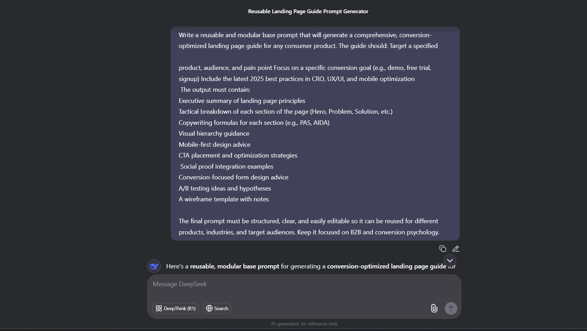
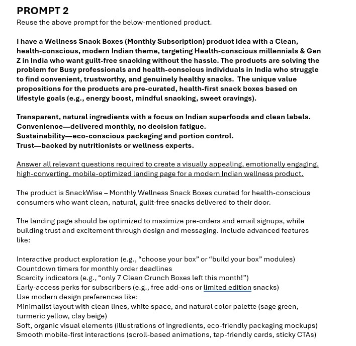
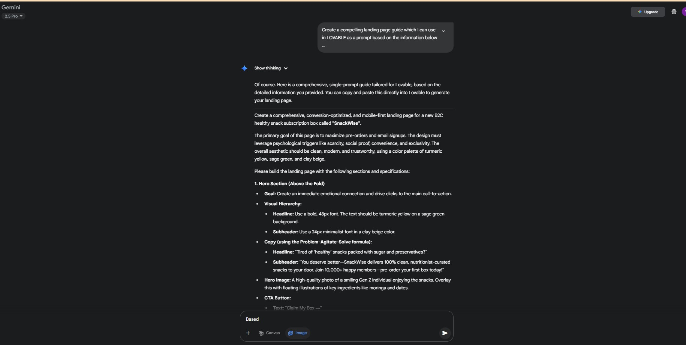

# AI-Powered product webpage generator

## Project Overview
This project is about using AI to generate a landing website for a product from scratch. I built an end-to-end workflow that takes a consumer product idea and turns it into a full landing page guide using chain prompting, model evaluation, and Lovable (a prompt-to-website tool). It's aimed at marketers, product teams, and founders who want fast, optimized web copy without starting from zero.

## Objectives
- Use **chain prompting** to break down a single input into structured, conversion-optimized sections.
- Apply **model evaluation techniques** to refine outputs and improve clarity, UX principles, and persuasive copy.
- Use **Lovable** to transform AI-generated prompts into a real, working landing page.
- Show how AI can assist in product messaging, landing page layout, and user flow—all from minimal input.

---

### 📸 Screenshots & Prompts

#### 🧱 Base Prompt

Click to view base prompt

#### 🔁 Optimized Prompt

Click to view optimized version

#### ✅ Final Prompt Version

Click to view final version

---

## Key Technical Achievements
- Designed a **modular base prompt** that works across different product types.
- Applied **copywriting frameworks** like PAS and AIDA directly within AI-generated content.
- Used **conversion best practices** for 2025 including mobile UX, social proof design, and persuasive CTAs.
- Integrated **Lovable** for visualizing the final landing page with zero frontend code.

---

## Key Insights
- AI can generate not just web content, but a full structured guide—from hero sections to wireframes.
- Using clear step-by-step prompts helps the AI give better, more natural answers
- Evaluating model outputs critically (not blindly accepting) leads to sharper, more effective messaging.
- Small tweaks in tone and CTA placement massively impact conversion potential.

---

## My Key Learnings
- **Prompt design is everything**. The quality of outputs is directly tied to the structure and specificity of the prompts.
- **Chain prompting** helps break down complex tasks into manageable pieces that AI handles more effectively.
- **AI doesn’t replace thinking**—it enhances it. Product knowledge and conversion understanding still matter.
- Tools like Lovable make it easy to bridge the gap between content and frontend design without touching code.

---

## 🖥️ Live Landing Page (via Lovable)
👉 [View SnackWise landing page here](https://snackwise-landing-page.lovable.app/)

## 📝 PDF Output of Landing Page  
📄 [Landing page in PDF form](./lovable%20website%20PDF.pdf)

